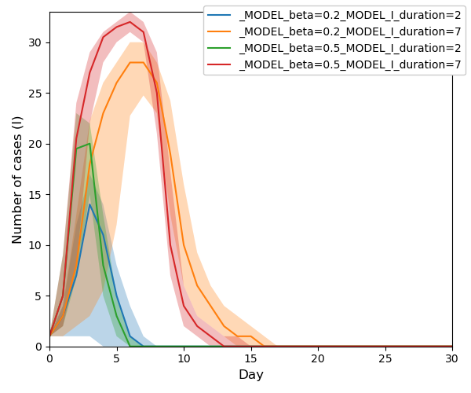
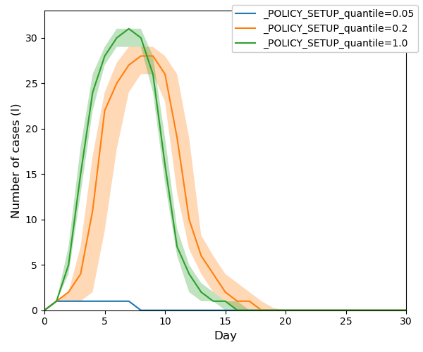
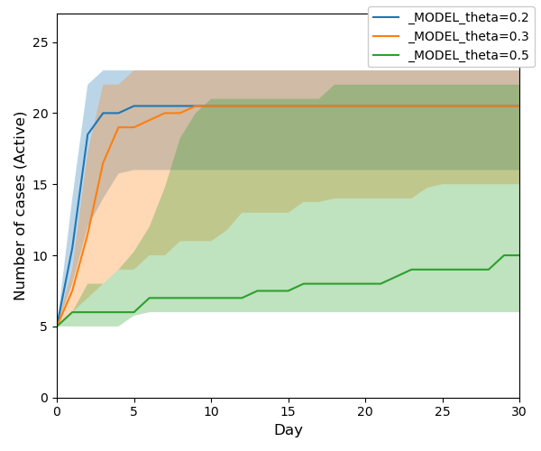
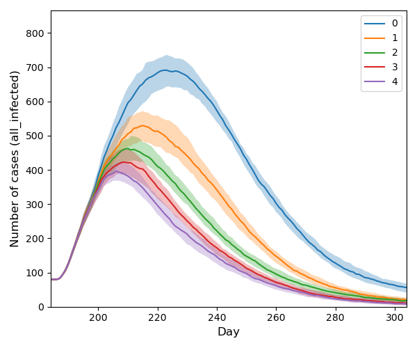
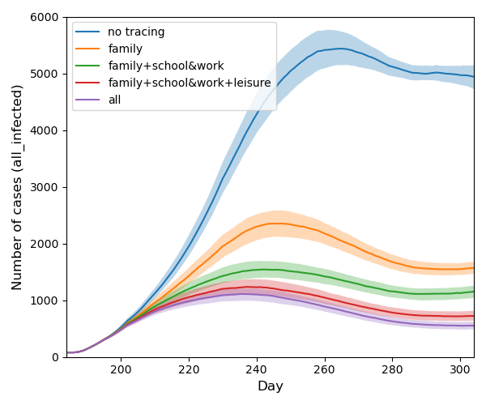
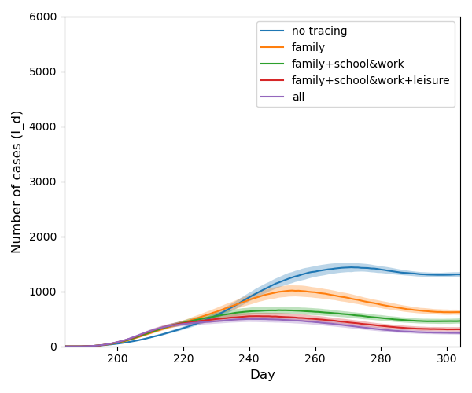
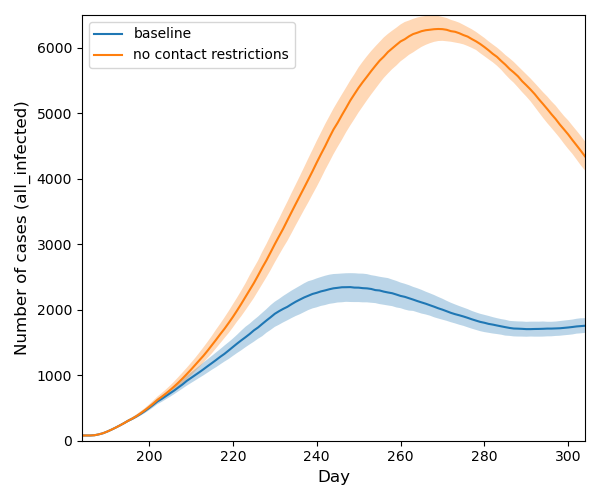
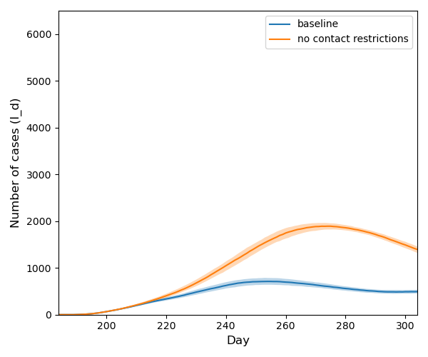

#  MAIS &nbsp; &nbsp; <a href="https://doi.org/10.5281/zenodo.16421566"></a>
## Multi-Agent Information/Infection Spread Model 


<!--- PDF BREAK -->

The MAIS Model is a collection of agent-based network models for the simulation of information or infection spread. 
You can use your own network (graph) or play with the demo graphs included in this repository. You can derive your own models with a customised set of agent states or encode customised policy modules.   

For information spread use:
  + [InfoSIRModel](src/models/agent_info_models.py)
    - the implementation of the SIR model
    - parameters:
      - `beta`: transmission strength
      - `I_duration`: duration in state I in days
    - policy functions:
      - [`Spreader`](src/policies/info_spreader.py): seeds the source of information to the node with pagerank corresponding to given quantile
  + [InfoTippingModel](src/models/agent_info_models.py)
    - the implementation of Tipping model
    - parameters:
        - `theta`: the threshold
  + [RumourModel](src/models/agent_info_models.py)
    - SIR model for rumour spread on directed networks
    - parameters:
      - `beta`: transmission probability per contact
      - `I_duration`: duration in state I (in hours)
      - `init_I`: number of initially infected nodes
  + [RumourModelInfo](src/models/agent_info_models.py)
    - SIR model with temporal decay of infectiousness and an optional event-driven boost; designed for fitting real-world information cascades (e.g. Higgs Twitter dataset)
    - parameters:
      - `lambda0`: base transmission rate
      - `scale`: decay rate of infectiousness with time spent in state I
      - `beta_duration`: probability of spontaneous recovery per step
      - `t_event`: time step at which an external event boosts spread
      - `event_boost`: strength of the event boost
      - `decay`: decay rate of the event boost
      - `init_I`: number of initially infected nodes

 For infection spread use:
   + [SimulationDrivenModel](src/models/agent_based_network_model.py)
      - See the [model documentation](doc/model.md) for technical details.


## Examples of Simulation Results

Please follow the links to find out more details about the examples presented.
+ InfoSIRModel <br>
  ```console
  cd scripts
  source verona_sir.sh
  ```
  Simple examples of information spread modelling using SIR model `InfoSIRModel`.<br>
  
  
  ```console
  cd scripts
  source verona_spreader.sh
  ```
  Simple examples of information spread modelling using SIR model `InfoSIRModel` with different spreader policies.<br>
  
  
  
+ TippingModel <br>
  ```console
  cd scripts
  source verona_tipping.sh
  ```
  Simple examples of information spread modelling using Tipping model `InfoTippingModel`.<br>
  
  
+ Higgs Twitter – `RumourModel` <br>
  ```console
  cd scripts
  source higgs_sir.sh
  ```
  Grid sweep of `beta` and `I_duration` for `RumourModel` on the real-world Higgs Twitter network.

+ Higgs Twitter – `RumourModelInfo` <br>
  ```console
  cd scripts
  source higgs.sh 
  ```
  Simulation of information spread with temporal decay and event boost using fitted parameters.

+ [Demo](doc/demo.md) <br>
  Simple examples of infection transmission model using `SimulationDrivenModel`.<br>
  

+ [Experiment1](doc/experiment1.md) and [Experiment2](doc/experiment2.md) <br>
 More sophisticated examples of experiments with `SimulationDrivenModel`. <br>
 <table>
<tr>
  <td></td>
  <td></td>
  </tr>
  <tr> 
    <td> Infected individuals </td>
    <td> Detected individuals </td>
  </tr>
</table>  

<table>
<tr>
  <td></td>
  <td> </td>
  </tr> 
  <tr> 
    <td>Infected individuals (active cases)</td>
    <td>Detected individuals (active cases)</td>
  </tr>
</table> 

## Project Structure

```
MAIS/
├── src/
│   ├── models/          # Core simulation models and engines
│   │   ├── agent_based_network_model.py   # SimulationDrivenModel (infection spread)
│   │   ├── agent_info_models.py           # InfoSIRModel, InfoTippingModel, RumourModel, RumourModelInfo
│   │   ├── engine.py, engine_daily.py, …  # Simulation engine variants
│   │   ├── states.py                      # Agent state definitions
│   │   └── model_zoo.py, load_model.py    # Model registry and loading
│   ├── policies/        # Policy modules (contact tracing, testing, vaccination, quarantine, …)
│   ├── graphs/          # Graph generation and loading
│   ├── model_m/         # Extended "Model M" variant
│   ├── hyperparam_search/  # CMA-ES and grid search for parameter fitting
│   └── utils/           # Config parsing, plotting, history, random seeds, sparse utilities
├── scripts/             # Entry points: run_experiment, run_multi_experiment, plot_experiments, run_search
├── config/              # INI files for experiments, policy and model parameters
│   ├── model_params/
│   ├── policy_params/
│   └── hyperparam_search/
├── data/
│   ├── m-input/         # Input graphs (demo, papertown, verona, higgs-twitter)
│   ├── fit_data/        # Fitting target data
│   └── output/          # Simulation output (model results, graphs, images)
└── doc/                 # Documentation and figures
```

# Installation

### Using uv (recommended)

[uv](https://docs.astral.sh/uv/) is the fastest way to get started:

```console
uv sync
```

This creates a virtual environment and installs all dependencies from `pyproject.toml`.
To run scripts within the environment use `uv run`:

```console
cd scripts
uv run python run_experiment.py -r ../config/verona_sir.ini my_experiment
```

Or activate the environment manually:

```console
source .venv/bin/activate
```

### Using pip

```console
python -m venv .venv
source .venv/bin/activate
pip install .
```

### Using conda

```console
conda create -n mais python=3.12 -y
conda activate mais
conda install --file requirements_conda.txt -y
pip install -r requirements.txt
```

### Optional: graph-tool

If you want to create an animation from your simulation (script [animate.py](scripts/animate.py)) or use the `Spreader policy` function for information spread seeding, install `graph-tool`:

```console
conda install -c conda-forge graph-tool
```

**Troubleshooting:** Graph-tool often takes extreme amount of time to install. In such case, it helps to first install `graph-tool` into a clean new environment, and then install the rest of the packages.

# Usage

All the executable scripts are located in the [scripts](scripts) subfolder. So first of all run:

```console
cd scripts
```

Most of the following commands take as a parameter the name of an INI file. The INI file describes all the configuration
settings and locations of other files used. Please refer to [INI file specification](doc/inifile.md) for details.

**Tip**: Instead of a single value in INI file, use a semicolon (;) separated list of values. 
Such INI file will be expanded to the set of configs, each config will be processed separately.

There are several INIs provided so that you can base your experiments on these settings:

|filename|description|
|---|---|
|[verona_sir.ini](config/verona_sir.ini)| Information spread using SIR model on a toy graph *Verona*.|
|[verona_tipping.ini](config/verona_tipping.ini)| Information spread using Tipping model on a toy graph *Verona*.|
|[demo.ini](config/demo.ini)| Infection spread on a graph of a small region (5k inhabitants) for demonstration purposes.|
|[higgs_sir.ini](config/higgs_sir.ini)| Information spread using `RumourModel` on the Higgs Twitter graph; sweeps over several `beta` and `I_duration` values.|
|[higgs.ini](config/higgs.ini)| Information spread using `RumourModelInfo` (temporal decay + event boost) on the Higgs Twitter graph.|


### 1. Running your experiments

Run your experiment. Note that the first time you run it, the graph is loaded from CSV files, which may take time for bigger graphs.

+ If you wish to run one simulation only, use `run_experiment.py`:

```console
python run_experiment.py -r ../config/verona_sir.ini my_experiment
```
After the run finishes, you should find the output CSV files  in the directory specified as `output_dir`
in your [INI file](doc/inifile.md#task). The INI files provided use `data/output/model` directory.
The filenames begin with the prefix `history_my_experiment`. 

+ For a proper experiment, you should evaluate the model more times. You can do it in parallel using:

```console
python run_multi_experiment.py -R ../config/random_seeds.txt --n_repeat=100 --n_jobs=4 ../config/verona_sir.ini my_experiment
```

By default it produces a ZIP file with the resulting history files. You can change `output_type` to FEATHER and the result
will be stored as one data frame in the feather format. The resulting file is stored in the directory specified
by `output_dir` and its name has a prefix `history_my_experiment`.

### 3. Result visualisation

Now you can create a plot from the resulting files and save it to the path specified by `--out_file PATH_TO_IMG`.

```console
python plot_experiments.py ../data/output/model/history_my_experiment_*.zip --out_file ./example_img.png
```
### 4. Animation 

 If you want to run animation, you need to have a file with node states from a simulation run. This file is generated if you use 

```
save_node_states = Yes
```
in your config file. Such a config file is for example [verona_ani.ini](config/verona_ani.ini). 

First you run a simulation with such config file
```console
python run_experiment.py -r ../config/verona_ani.ini animation
```
Then you can run the animation:
```console
python animate.py ../config/verona_ani.ini --nodes_file ../data/output/model/node_states_animation.csv
```


### 5. Complete example: Higgs Twitter dataset

This section walks through the full workflow for the [Higgs Twitter dataset](https://snap.stanford.edu/data/higgs-twitter.html) — a real-world graph of ~450k nodes capturing retweet activity around the discovery of the Higgs boson (July 2012).

#### Step 1 – Download the graph

```console
cd data/m-input/higgs-twitter
source download_graph.sh
```

This downloads `higgs_edges.csv.gz` from the SNAP repository. The graph is loaded and cached as `higgs_simple.pickle` on the first simulation run.

#### Step 2 – (Optional) Fit model parameters with CMA-ES

The `RumourModelInfo` parameters can be fitted to the observed retweet counts stored in `data/fit_data/retweets.csv`:

```console
cd scripts
python run_search.py \
    ../config/higgs.ini \
    ../config/hyperparam_search/cmaes_higgs.json \
    --fit_data ../data/fit_data/retweets.csv \
    --fit_column inc_I \
    --run_n_times 10 \
    --n_jobs 4 \
    --out_dir ../data/output/higgs_search
```

The search optimises `lambda0`, `scale`, `beta_duration`, `event_boost`, and `decay` using CMA-ES (up to 100 000 evaluations, population size 30). Results are written to `../data/output/higgs_search/`. Copy the best-found parameters into a new INI file (e.g. `config/higgs_fitted.ini`) before the next step.

#### Step 3 – Run the simulation

Run 10 repetitions of the fitted model (adjust `--n_repeat` and `--n_jobs` as needed):

```console
cd scripts
python run_multi_experiment.py \
    -R ../config/random_seeds.txt \
    --n_jobs 4 \
    --n_repeat 10 \
    ../config/higgs_fitted.ini \
    higgs_run
```

Or use the provided convenience script (uses `higgs_fitted.ini`):

```console
cd scripts
source higgs.sh 
```

Output ZIP files are written to `data/output/model/`.

#### Step 4 – Visualise results

```console
cd scripts
python plot_experiments.py \
    ../data/output/model/history_higgs_run_*.zip \
    --column inc_I \
    --out_file ../data/output/higgs_result.png
```

<!--- PDF BREAK --><!--- PDF BREAK -->

## Configuration and Advanced Features

Please consult [How to run simulations](doc/run.md) for options of individual scripts,
[INI file specification](doc/inifile.md), and [How to fit the paremeters](doc/run.md#6-fitting-your-model).

